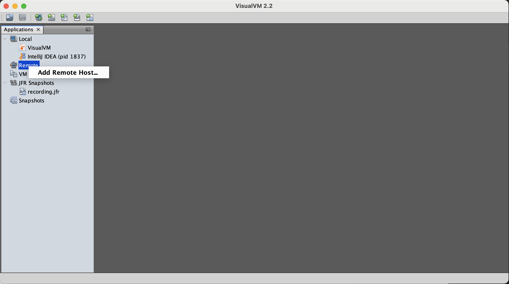
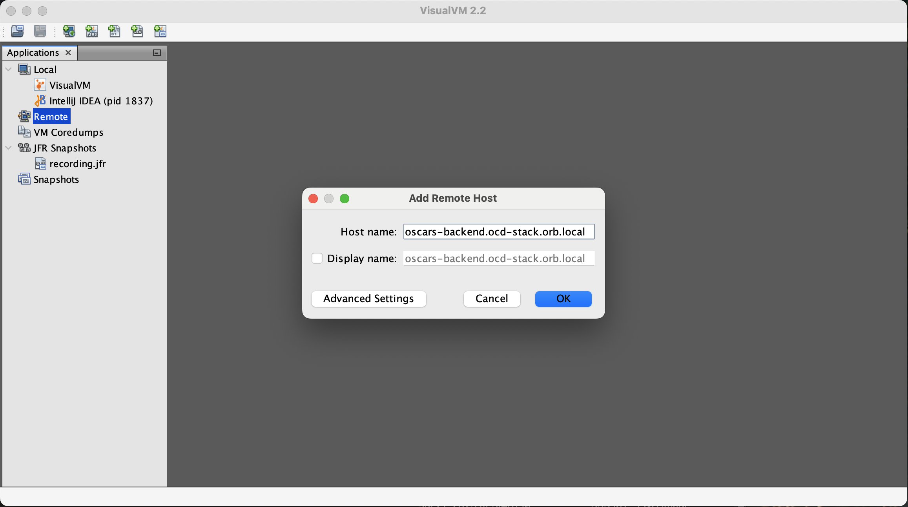
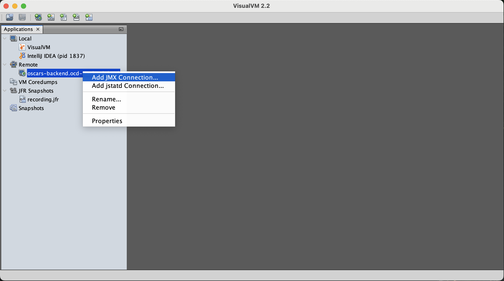
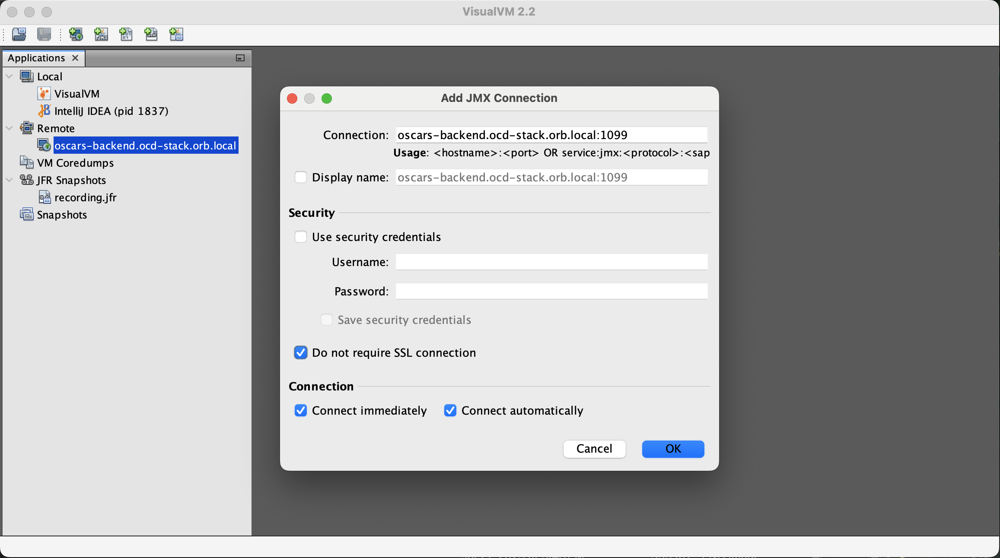
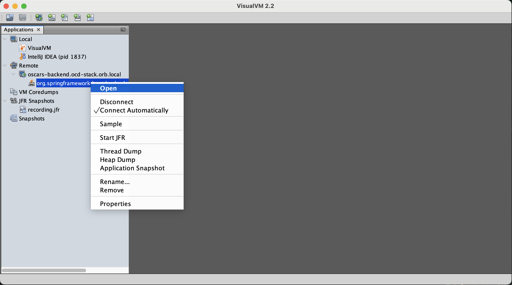

# Profiling

This document provides setup instructions to profile the `oscars-backend` service as part of local development, and the CI/CD pipeline.

## Profiling during development

We leverage VisualVM to view real time profiling data of the `oscars-backend` service.
Please obtain [VisualVM](https://visualvm.github.io) for your platform.

The local `oscars-backend` ocd-stack service is started with the appropriate Java arguments to enable remote JMX connections (without security enabled).

_**NOTE:** Staging and production environments should always have HTTPS and security authentication configurations enabled._

## Steps to connect VisualVM

1. Right-click "Remote" in the Applications sidebar view, and click "Add Remote Host" 
1. In the "Add Remote Host" modal dialog, set the Host name to the `oscars-backend` domain. If using OrbStack, it should be [oscars-backend.ocd-stack.orb.local](oscars-backend.ocd-stack.orb.local). Click "OK" to save and close the modal dialog. 
1. There should now be an item in the "Remote" section of the Applications sidebar. Right-click the new entry, and click "Add JMX Connection". 
1. In the "Add JMX Connection" modal dialog, the "Connection" string should specify port 1099 (`hostname:port` format). For local development, ensure "Do not require SSL connection" is checked. Keep everything else as-is. Click "OK" to save and close the modal dialog. 
1. There should now be an item under "Remote > oscars-backend.ocd-stack.orb.local" named `org.springframework.boot.loader.launch.JarLauncher (pid 1)`. Right-click it and then click "Open". 
1. A new tab should have opened within VisualVM. This tab allows us to monitor multiple aspects of the `oscars-backend` application stack using the "Monitor" sub-tab. We can also sample CPU and Memory using the Sampler sub-tab.

## Save Java Flight Recorder Data in VisualVM

1. Right click "Remote > oscars-backend.ocd-stack.orb.local > org.springframework.boot.loader.launch.JarLauncher (pid 1)". Click "Start JFR". The VisualVM status bar (lower-right side of the window) will show "Starting JFR Recording".
2. Interact with the `oscars-backend` service as usual.
3. Use the "Dump JFR" option at any time during the JFR session. Please take note of _where_ the JFR file is being saved within the `oscars-backend` container!
4. When you are done, right click "org.springframework.boot.loader.launch.JarLauncher (pid 1)" and click "Stop JFR".
5. Extract the JFR dump file from the `oscars-backend` container if you need it. The `oscars-backend` container is not currently set up to use volumes, so any saved file data will not persist when the service is relaunched!

## Profiling within the CI/CD pipeline

1. We have an `ocd-stack` docker compose service named `oscars-backend-profile` that launches a separate container. We can configure the `oscars-backend-profile` service with the following environment variables:
   * `DELAY_MIN`, specifies how long to wait before starting the JFR data recording. See the `sleep` command arguments (examples: 10 seconds as `10s`, 5 minutes as `5m`, etc.)
   * `DURATION_MIN`, specifies how long to run the JFR data recording. See the `sleep` command arguments (examples: 10 seconds as `10s`, 5 minutes as `5m`, etc.)
   * `TARGET_HOST`, specifies the `hostname:port` formatted value we establish a JMX connection with.
1. Although not implemented as of the time of this writing, we could potentially run automated `oscars-backend' interaction simulations during the recording duration.
1. After the DURATION_MIN time has elapsed, the JFR data will be dumped to `/app/recording.jfr` within the `oscars-backend` container.
1. We can have the JFR recording extracted from the container for later viewing, using VisualVM or similar.
